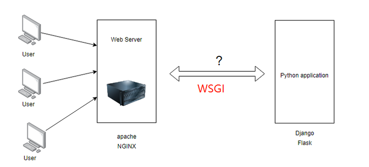
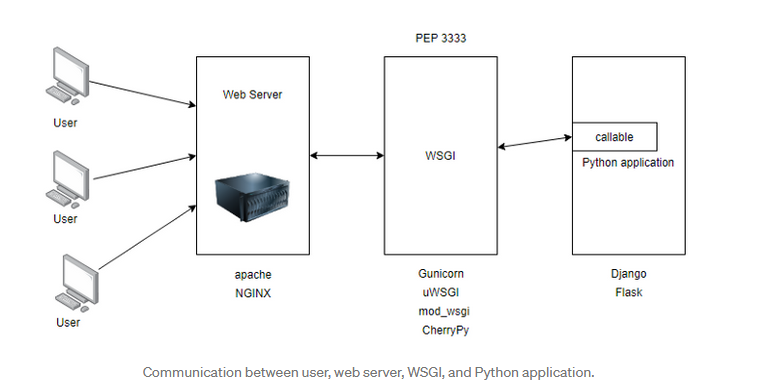
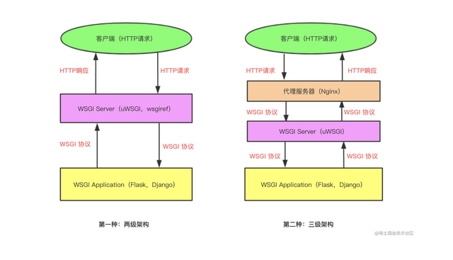
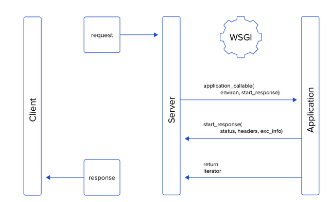

<!--
 * @Description:
 * @email: 359066432@qq.com
 * @Author: lhj
 * @software: vscode
 * @Date: 2021-10-24 21:11:11
 * @platform: windows 10
 * @LastEditors: lhj
 * @LastEditTime: 2021-10-27 09:49:23
-->

# django 的 WSGI 服务

众所周知，所有的服务都是按照一定的协议对数据进行 pack,通过 HTTP/TCP 发送到指定 IP:PORT,那么 DJANGO 作为一个 WEB 框架，本身也是绑定监听一个端口，启动一个 HTTP 服务,并且遵循了 `WSGI`协议

## 何为 `WSGI` ?

WSGI 全称 Web Server Gateway Interface，从名称可理解为一个网关，是一个描述 web 服务器和 Python web 应用程序或框架之间通信的规范，它解释了web服务器如何与python-web应用程序/框架通信，以及web应用程序/框架如何被链接以处理请求，怎么理解呢，我们都知道DJANGO的所有接口就是一个个PYTHON 函数或者类，那么从客户端发起一个请求，到一个具体的api处理这一过程，数据是按照什么规范，怎么被传递的呢，``WSGI``就扮演了这个角色，可以说，它是扮演``HTTP请求``到``DJANGO-APP`` **中间者**的角色。
[注：python wsgi pep3333](https://www.python.org/dev/peps/pep-3333/)



## 为什么需要 ``WSGI``
个人猜测可能有
- 解耦：通过WSGI,将PYTHON application 和 HTTP请求解耦合，后期完全可以更替WSGI为其他更优秀的网关
- 增加吞吐量：我们都知道一个WEB应用同一时间可能会有很多个请求，如果直接请求到具体的PYTHON-APPLICATION，可能存在吞吐量上的瓶颈，加一层可能能更高效的处理多个请求？（众所周知，没有什么是加一层解决不了的）

## python 中的`wsgi`
-python中的WSGI服务规范如下：
- Must be a `callable` with ``environ`` and `start_response` parameters.
- Must call the ``start_response`` callback before sending the body.
- Must return an `iterable` with pieces of the document body.


```python

def application(environ, start_response):
    body = b'Hello world!\n'
    status = '200 OK'
    headers = [('Content-type', 'text/plain')]
    start_response(status, headers) # 必须
    return [body]


class Application:
    def __init__(self, environ, start_response):
        self.environ = environ
        self.start_response = start_response

    def __iter__(self):
        body = b'Hello world!\n'
        status = '200 OK'
        headers = [('Content-type', 'text/plain')]
        self.start_response(status, headers)
        yield body

## Server Interface
def write(chunk):
    '''Write data back to client'''
    ...

def send_status(status):
   '''Send HTTP status code'''
   ...

def send_headers(headers):
    '''Send HTTP headers'''
    ...

def start_response(status, headers):
    '''WSGI start_response callable'''
    send_status(status)
    send_headers(headers)
    return write

# Make request to application
response = application(environ, start_response)
try:
    for chunk in response:
        write(chunk)
finally:
    if hasattr(response, 
```

### environ 参数
一个dict-object,获取可以理解为 `Request` 参数？
例如：`$ curl 'http://localhost:8000/auth?user=obiwan&token=123'`
则 `environ` 参数可能为如下：

|Key 	   |     Value |	    Comments|
| ----------- | ----------- |----------- |
|REQUEST_METHOD 	|"GET" |	|
|SCRIPT_NAME 	|"" 	      |  server setup dependent
|PATH_INFO 	   | "/auth" 	|
|QUERY_STRING 	|"token=123" |	
|  CONTENT_TYPE |	"" 	|
|CONTENT_LENGTH |	"" 	
|SERVER_NAME 	|"127.0.0.1" |	server setup dependent
|SERVER_PORT 	|"8000" 	|
|SERVER_PROTOCOL 	|"HTTP/1.1" |	
|HTTP_(...) 	|	|Client supplied HTTP headers
|wsgi.version 	|(1, 0) |	tuple with WSGI version
|wsgi.url_scheme |	"http" 	|
|wsgi.input |		|File-like object|
|wsgi.errors |		File-like object|
|wsgi.multithread 	|False| 	True if server is multithreaded|
|wsgi.multiprocess 	|False 	|True if server runs multiple processes
|wsgi.run_once |	False |	True if the server expects this script to run only 

### start_response 参数
在app 返回 body之前调用，必须携带`status`,`header`参数

- status:即为HTTP status，比如404，403...
- header:即为响应头，必须为list or tuple，比如
```python
response_body = json.dumps(data).encode('utf-8')

headers = [('Content-Type', 'application/json'),
           ('Content-Length', str(len(response_body))
```

