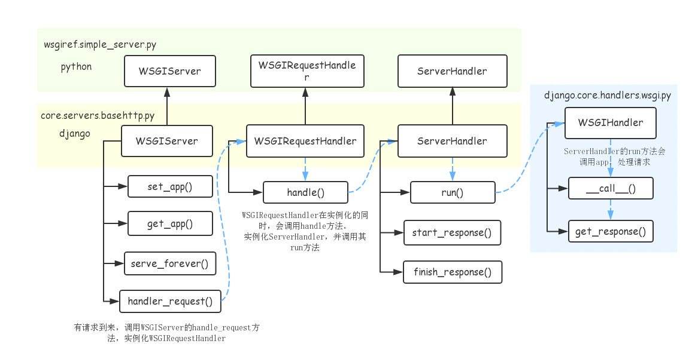

<!--
 * @Description: 
 * @email: 359066432@qq.com
 * @Author: lhj
 * @software: vscode
 * @Date: 2021-10-29 01:12:35
 * @platform: windows 10
 * @LastEditors: lhj
 * @LastEditTime: 2021-10-30 01:41:59
-->

## WSGIServer
继承关系为：WSGIServer -> simple_server.WSGIServer -> HTTPServer -> HTTPServer
```python

class WSGIServer(HTTPServer):

    """BaseHTTPServer that implements the Python WSGI protocol"""

    application = None

    def server_bind(self):
        """Override server_bind to store the server name."""
        HTTPServer.server_bind(self) # 这里 = super().server_bind()
        self.setup_environ() # 将server name 储存到环境变量

    def setup_environ(self):
        # Set up base environment
        env = self.base_environ = {}
        env['SERVER_NAME'] = self.server_name
        env['GATEWAY_INTERFACE'] = 'CGI/1.1'
        env['SERVER_PORT'] = str(self.server_port)
        env['REMOTE_HOST']=''
        env['CONTENT_LENGTH']=''
        env['SCRIPT_NAME'] = ''

    def get_app(self):
        return self.application

    def set_app(self,application):
        self.application = application

# WSGI INSTANCE
    def serve_forever(self, poll_interval=0.5):
       """
        Handle one request at a time until shutdown.
        Polls for shutdown every poll_interval seconds. Ignores
        self.timeout. If you need to do periodic tasks, do them in
        another thread.
        """
        
        self.__is_shut_down.clear()
        try:
            # XXX: Consider using another file descriptor or connecting to the
            # socket to wake this up instead of polling. Polling reduces our
            # responsiveness to a shutdown request and wastes cpu at all other
            # times.
            with _ServerSelector() as selector:
                selector.register(self, selectors.EVENT_READ)

                while not self.__shutdown_request:
                    ready = selector.select(poll_interval)
                    # bpo-35017: shutdown() called during select(), exit immediately.
                    if self.__shutdown_request:
                        break
                    if ready:
                        self._handle_request_noblock()

                    self.service_actions()
        finally:
            self.__shutdown_request = False
            self.__is_shut_down.set()

```
<!-- TODO SOCKET LEARN -->
这里可以先了解[python socket](www.baidu.com) 

上个note说到，`runsever`说到底就是实例化一个`WSGIServer`，然后调用`serve_forever`方法,启动一个监听服务
然后就是一个正常的WGSI请求-->处理的过程,我们再看上一个NOTE提到的`RUN`方法
```python

def run(addr, port, wsgi_handler, ipv6=False, threading=False, server_cls=WSGIServer):
    server_address = (addr, port)
    if threading:
        httpd_cls = type('WSGIServer', (socketserver.ThreadingMixIn, server_cls), {})
    else:
        httpd_cls = server_cls
    httpd = httpd_cls(server_address, WSGIRequestHandler, ipv6=ipv6)
    if threading:
        # ThreadingMixIn.daemon_threads indicates how threads will behave on an
        # abrupt shutdown; like quitting the server by the user or restarting
        # by the auto-reloader. True means the server will not wait for thread
        # termination before it quits. This will make auto-reloader faster
        # and will prevent the need to kill the server manually if a thread
        # isn't terminating correctly.
        httpd.daemon_threads = True
    httpd.set_app(wsgi_handler)
    httpd.serve_forever()

```
这里的`wsgi_handler`为一个具体 `WSGIHandler`实例，用来处理处理`REQUEST`请求
这里我们再理解下这个图：

理解一下，主要有几点:
- 1 django 自己对python 原生WSGIServer,WSGIRequest,ServerHandle进行了封装.
- 2 request 到来时，走的原生 `handler_request`方法，然后实例化WSGIRequestHandler。
再看看上面的`httpd = httpd_cls(server_address, WSGIRequestHandler, ipv6=ipv6)`,
其实就是`WSGIServer(server_address, WSGIRequestHandler, ipv6=ipv6)`
```PYTHON 原生WSGI 服务
   ...
       def process_request(self, request, client_address):
        """Call finish_request.

        Overridden by ForkingMixIn and ThreadingMixIn.

        """
        self.finish_request(request, client_address)
        self.shutdown_request(request)

    def server_close(self):
        """Called to clean-up the server.

        May be overridden.

        """
        pass

    def finish_request(self, request, client_address):
        """Finish one request by instantiating RequestHandlerClass."""
        self.RequestHandlerClass(request, client_address, self)
    ...

```
这里的`RequestHandlerClass(request, client_address, self)`就是 `WSGIRequestHandler(request, client_address, self)`